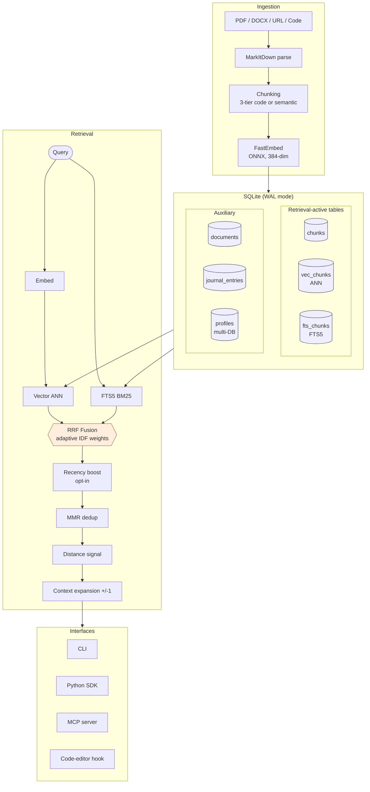
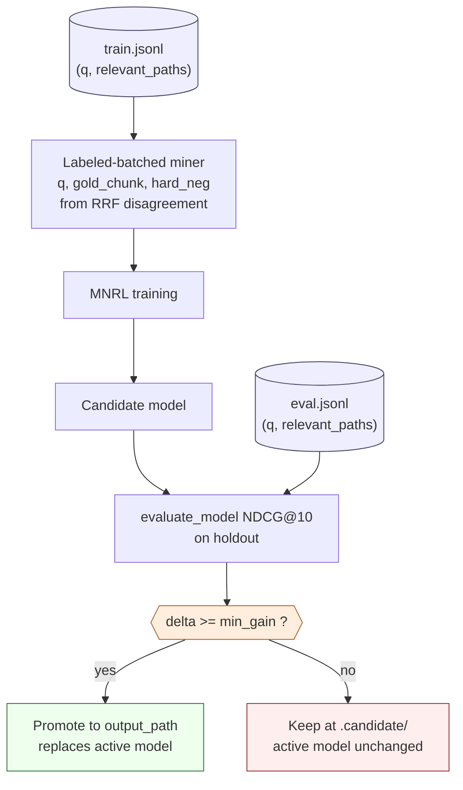

# vstash v2: Eval-Gated Domain Adaptation for Local-First LLM Memory

**Jayson Steffens**
[github.com/stffns/vstash](https://github.com/stffns/vstash)

---

## Abstract

We present **vstash v2**, a local-first document memory system
whose central contribution is a **gated domain-adaptation loop**:
a deployable cycle of mining, training, eval-gating, and promotion
that converts retrieval domain adaptation from a one-shot research
artifact into a repeatable production pattern.  The system builds
on a hybrid retrieval substrate (RRF over vector + FTS5 in a
single SQLite file) introduced in v1 (arXiv:2604.15484, April
2026).  This paper introduces four contributions:

**(1) Cross-domain transfer failure of BEIR-tuned weights,
motivating per-domain models.** The v1 BEIR fine-tune loses to
vanilla BGE-small by -2.45pp NDCG@10 on a 102-query LongMemEval-s
holdout, providing direct evidence that benchmark-tuned weights
can regress on chat-memory retrieval.

**(2) Eval-gated labeled-retrain mode as a safety mechanism for
continual domain adaptation.** A new CLI mode accepts user-supplied
`(query, relevant_paths)` JSONL files for both training and
held-out evaluation, and refuses to save fine-tunes that regress
NDCG@10 on the holdout.  To our knowledge, we have not found
prior open-source retrieval systems that combine user-supplied
labeled retraining with an automatic refuse-to-save evaluation
gate.

**(3) `bge-small-rrf-lme-v1`, a chat-memory specialist that
preserves general retrieval.** Training on 398 labeled LongMemEval
queries through the gated loop lifts holdout R@5 by +3.79pp (95%
CI [+1.72, +6.19], paired bootstrap B=1000) over vanilla
BGE-small; R@1 trends positive but is directional on the n=102
holdout.  R@10 saturates at 0.96 for both arms (ranking, not
coverage, is the lever).  Crucially, the chat-tune does **not**
regress on general BEIR retrieval: paired bootstrap on the 5-dataset
BEIR slice gives macro delta -0.0024 with 95% CI [-0.0050,
+0.0002], statistically indistinguishable from base BGE.  The
gated loop applied to a target domain is therefore a
Pareto-safe specialization (no detectable out-of-domain regression),
not a trade-off.  Against a calibrated
late-interaction baseline implemented faithfully from the
published ColBERTv2 checkpoint, vstash remains competitive while
running approximately 3x faster at P50 and 6x faster at P99 on
CPU vs the baseline on a T4 GPU.

**(4) Self-supervised embedding refinement (retained from v1, post-v0.34 reference).**
Vector/FTS top-K disagreement provides a free training signal
without human labels; fine-tuning BGE-small with MNRL on the v3
H-R9 winning recipe (`bge-small-rrf-v4`, retrained on post-v0.34
code) lifts macro NDCG@10 by **+0.0204 absolute / +4.9% relative
over the vstash BGE-small base** on the 5-dataset BEIR slice (95%
CI [+0.0154, +0.0256], paired bootstrap B=1000, eval-stochastic).
Multi-seed retraining (4 seeds) shows training-stochastic std of
0.0005 on macro NDCG@10, an order of magnitude tighter than the
eval-stochastic CI; the v4 lift is robust to both query
resampling and training seed.  Three of five datasets show
statistically significant lifts: FiQA +0.0537 [+0.0383, +0.0697],
SciFact +0.0324 [+0.0168, +0.0511], NFCorpus +0.0116 [+0.0020,
+0.0213].  The vstash hybrid pipeline with the BGE-small base
alone already exceeds ColBERTv2 published macro (0.4214 vs 0.402,
+4.8%, Table 4); the fine-tune adds the incremental +4.9% on top.
This decomposition is the headline of v2: the deployable
contribution is the substrate (adaptive RRF + corrected cosine
metric + MMR + distance signal), not the fine-tune.  The
fine-tune is a domain-specialization tool.

Four fine-tuned models are published on HuggingFace:
`bge-small-rrf-v4` (post-v0.34 honest reference, recommended
default for new vstash deployments), `bge-small-rrf-v3`
(pre-v0.34 reference snapshot, retained for reproducibility),
`bge-small-rrf-v2` (76K MNRL + hard-neg, NFCorpus champion), and
`bge-small-rrf-lme-v1` (chat-memory specialist, Section 6).  All
code, data, and reproducible experiment scripts are open-source.

**Our results suggest that production memory systems benefit from
a deployable adaptation loop rather than a single universal
embedder: the substrate already produces benchmark-competitive
retrieval, and per-domain fine-tunes via the gated loop add
Pareto-safe specialization without measurable out-of-domain
regression.**

---

## 1  Introduction

Large language model agents increasingly require persistent memory --
the ability to store, retrieve, and prioritize information across
sessions.  While cloud-hosted vector databases serve this need at
scale, many use cases demand local-first operation: developer tooling,
personal knowledge management, privacy-sensitive workflows, and
offline agents.

Existing local solutions face three gaps already documented in v1:

**Retrieval quality.** Pure vector search misses exact keywords
(error codes, proper names); pure keyword search misses semantic
paraphrases.  Hybrid fusion helps, but combining scores from
incompatible distributions (cosine distance vs. BM25 rank) is
non-trivial.

**Temporal awareness.** Documents accessed yesterday should rank
differently from documents untouched for months.  Most RAG systems
treat all chunks equally regardless of usage history.

**Confidence estimation.** When every query returns results with
uniformly high scores, the system cannot distinguish "I found
something relevant" from "I returned the least irrelevant thing
I have."

We introduced **vstash** in v1 as a single-file system built on
SQLite that addresses all three gaps.  The key v1 insight was that
adaptive RRF fusion -- adjusting vector and keyword weights per
query using IDF analysis -- combined with MMR deduplication and
distance-based relevance signaling, produces retrieval quality
competitive with published baselines on standard benchmarks.

v2 adds a fourth, sharper gap.  Existing retrieval systems
optimize for benchmark performance, implicitly assuming a single
embedding space generalizes across domains.  Our results challenge
this assumption.

**Domain mismatch.** A model that wins on BEIR (general-purpose
retrieval) does not necessarily win on chat memory.  In Section 6
we show that the v1 fine-tune (`Stffens/bge-small-rrf-v2`), which
beats vanilla BGE-small on every BEIR dataset, *loses* to vanilla
on the LongMemEval chat-memory benchmark (-0.0245 NDCG@10 on a
102-query stratified holdout).  The fix -- training a
*domain-specific* fine-tune via real (question, gold-session)
labels rather than chunk-prefix pseudo-queries -- becomes the v2
headline result and motivates the new gated domain-adaptation loop
exposed via the labeled-query retrain CLI (Section 5.6).

**A cross-cutting observation.** Across both BEIR and LongMemEval
evaluations, the retrieval improvements we measure consistently
concentrate at low K (R@1 through R@5), while R@50 saturates near
1.0 across all variants.  This pattern suggests that modern
embedding pipelines combined with hybrid retrieval already solve
the coverage problem -- the gold passage almost always appears
within the top-50 candidates -- and that the remaining headroom
is rank precision, not retrieval breadth.  We return to this
observation in Sections 6.3 and 8.5.

### Contributions

We organize our contributions around the v2 thesis.  The v1
contributions are retained as the retrieval substrate on which v2
builds (enumerated below), but the central claim of this paper is
that benchmark-quality retrieval does not transfer across domains,
and that the deployable answer is a gated adaptation loop, not a
single universal embedder.

**Primary contributions (v2):**

(1) **Domain mismatch evidence.** Direct evidence that BEIR-tuned
weights regress on chat-memory retrieval, motivating per-domain
models rather than universal embedders.

(2) **Eval-gated labeled-retrain mode.** A safety mechanism for
continual domain adaptation: training accepts user-supplied
`(query, gold)` JSONL labels, and the eval gate refuses to save
candidates that regress on a held-out slice.  We are not aware of
prior open-source retrieval CLIs that combine these two
properties.

(3) **`bge-small-rrf-lme-v1`, a chat-memory specialist** validated
against a calibrated late-interaction baseline.

The v1 contributions (self-supervised refinement, adaptive RRF,
negative result on post-RRF scoring, and a deployable substrate
with integrity checking, schema versioning, and observability)
form the retrieval substrate; this paper develops the v2 loop on
top of that substrate.

Secondary contributions include intra-document MMR deduplication,
context expansion, distance-based relevance signaling, hybrid
code-aware chunking, and the `vstash retrain` CLI command that
wraps the full domain-tune pipeline.

---

## 2  Related Work

**Memory for LLM agents.** MemGPT (Packer et al. 2023) introduced
virtual context management with explicit memory tiers.  Mem0
(Chhikara et al. 2025) and Memoria (Sarin et al. 2025) provide
production memory layers with cloud backends.  A-MEM (Xu et al.
2025) uses agentic self-organization.  Unlike these systems,
vstash operates entirely locally with zero cloud dependencies.

**Local-first agent memory.** Several concurrent projects share
vstash's SQLite + hybrid search architecture: palinode (git-native
markdown + sqlite-vec + RRF), cpersona (MCP server with 3-strategy
RRF), agentmem (FTS5 + vector with adaptive ranking), and
sqlite-memory (FTS5 + vector with offline sync).  None publish
formal NDCG evaluations on standard benchmarks.  neo4j-labs/
agent-memory takes an orthogonal approach with graph-native entity
extraction and temporal knowledge graphs, targeting relational
queries rather than dense retrieval.

**Hybrid retrieval.** Reciprocal Rank Fusion (Cormack et al. 2009)
merges ranked lists without requiring comparable scores.  Ma et
al. (2024) showed RRF outperforms learned re-rankers on out-of-
domain data.  Our contribution is adaptive per-query weight
adjustment using IDF analysis, not explored in prior RRF work.

**Hard negative mining for dense retrieval.** The quality of
dense retrieval models depends critically on the training
signal.  DPR (Karpukhin et al. 2020) established BM25 negatives
for training dense retrievers.  ANCE (Xiong et al. 2020)
introduced asynchronous hard-negative mining from the model's own
approximate nearest neighbors.  STAR (Zhan et al. 2021) refined
this with a two-stage approach using relevance labels.  More
recently, NV-Retriever (Lee et al. 2024) and BGE-M3 (Chen et al.
2024) demonstrated that carefully curated hard negatives at scale
produce state-of-the-art results on MTEB and BEIR.  Our approach
(Section 5) differs from this lineage in two respects: the
training signal comes from disagreement between two retrieval
modalities (dense and sparse) within the same system rather than
from external relevance labels or model-internal mining, and
the triples are generated at zero cost as a byproduct of normal
hybrid retrieval.  The closest precedent is BM25 negatives in
DPR, but our signal is bidirectional, capturing both dense
blind spots (chunks found by FTS but missed by vector) and
lexical blind spots (the reverse), whereas DPR mines only in
one direction.

**Temporal decay in memory.** The Ebbinghaus forgetting curve
(1885) inspires exponential decay models.  Zep (2025) uses
temporal knowledge graphs; MaRS (2025) models cognitive
forgetting.  We explored decay directly in the scoring formula
but found it did not improve retrieval quality on benchmarks
(Section 7).

**Chat-memory benchmarks (NEW in v2).** LongMemEval (Wu et al. 2024) evaluates
long-term memory in chat assistants across 500 questions in six
categories: single-session-user / -assistant / -preference,
multi-session, temporal-reasoning, and knowledge-update.  Each
question has a ~115K-token haystack of ~50 sessions and one or more
gold session labels.  Unlike conversational memory benchmarks that
use synthetic distractors (e.g., DialFact-style perturbations),
LongMemEval haystacks are real assistant conversations with
controlled gold-session placement.  We use it as the chat-memory
testbed in Section 6.

**Late-interaction retrievers.** ColBERTv2 (Santhanam et al. 2022)
and PLAID (Santhanam et al. 2022b) introduced a multi-vector
retriever where each token gets its own embedding and similarity
is computed via MaxSim.  Section 8.8 evaluates ColBERTv2 against
vstash on LongMemEval and BEIR.  Because the official Stanford
codebase has dependency requirements that conflicted with our
target evaluation environment, we use a faithful HuggingFace
re-implementation (raw `BertModel` + 768->128 linear projection
+ MaxSim einsum) and disclose a calibration band of ~0.04 NDCG@10
derived from BEIR (Appendix D).

**Domain-specific dense retrievers.** Prior work on domain
adaptation for retrievers (GPL, Wang et al. 2022; PROMPTAGATOR,
Dai et al. 2022) typically synthesizes queries via an LLM.  Our
labeled-retrain mode (Section 5.6) accepts real labels rather
than synthetic queries, and refuses to save candidates that
regress on a held-out slice -- a stronger guarantee than synthesis-
based methods which lack honest evaluation gates by construction.

---

## 3  System Architecture

vstash stores all data in a single SQLite database using WAL
mode for concurrent read safety.  The database contains five core
tables: *documents* (metadata, hierarchical tags, source type),
*chunks* (text segments with sequence numbers and access counters),
*vec_chunks* (sqlite-vec virtual table for ANN search, 384-dim
float vectors), *fts_chunks* (FTS5 virtual table with Porter
stemming), and *journal_entries* (append-only cross-session memory
for agents).  An auxiliary *profiles* table supports multi-DB
profile resolution but does not participate in the retrieval flow
(see Figure 2).


*Figure 2: vstash architecture. Ingestion produces 384-dim embeddings
and FTS5 indices into a single SQLite file; retrieval fuses both via
RRF, then applies optional recency boost, MMR dedup, distance-based
relevance signaling, and context expansion before exposing results
through any of four client interfaces.  (Carried over from v1.)*

<!--
LATEX/TIKZ stub for arXiv conversion of Figure 2:

  \begin{figure}[t]
    \centering
    \begin{tikzpicture}[
      node distance=8mm,
      box/.style   ={rectangle, rounded corners=2pt, draw, align=center,
                     minimum height=7mm, minimum width=22mm, font=\small},
      store/.style ={cylinder, shape border rotate=90, aspect=0.25, draw,
                     fill=blue!8, align=center, font=\footnotesize},
      gate/.style  ={diamond, draw, fill=orange!10, aspect=2, align=center,
                     font=\footnotesize, inner sep=1pt},
      arr/.style   ={->, >=stealth, thick}]
      % Three vertical regions: ingestion / storage / retrieval, then interfaces.
      % Match the Mermaid edge structure node-for-node.
    \end{tikzpicture}
    \caption{vstash architecture.  Ingestion produces 384-dim
      embeddings and FTS5 indices into a single SQLite file;
      retrieval fuses both via RRF, then applies optional recency
      boost, MMR dedup, distance-based relevance signaling, and
      context expansion before exposing results through any of four
      client interfaces.}
    \label{fig:architecture}
  \end{figure}
-->


### 3.1  Ingestion

Documents are parsed via MarkItDown (PDF, DOCX, HTML, URLs) or
read directly (code files).  Text is split into chunks using
semantic chunking or code-aware chunking (Appendix B) depending
on source type.  Chunks are embedded using FastEmbed (ONNX
Runtime, BAAI/bge-small-en-v1.5) at approximately 700 chunks per
second on CPU.  Batch ingestion via `add_documents_batch()`
amortizes transaction overhead for bulk loading.

### 3.2  Hybrid Search with RRF

Given a query *q*, we retrieve candidates from both indexes and
fuse via Reciprocal Rank Fusion:

```
RRF(c) = w_v / (k + r_v(c)) + w_f / (k + r_f(c))
```

where *r_v(c)* and *r_f(c)* are the ranks of chunk *c* in vector
and FTS5 results respectively, *k = 60*, and default weights
*w_v = 0.6*, *w_f = 0.4*.  These weights are overridden by
adaptive IDF weighting (Section 4).  Each query word is
individually double-quoted and joined with OR, preventing FTS5
Boolean operator injection.

### 3.3  Intra-Document MMR Deduplication

After RRF ranking, multiple chunks from the same document often
cluster in the top-*k*.  We apply intra-document Maximal Marginal
Relevance:

```
MMR(c) = L * norm_score(c) - (1 - L) * max_{s in S_d} cos_sim(emb(c), emb(s))
```

where *S_d* is the set of already-selected chunks from the same
document *d*, and *L = 0.5*.  Chunks from different documents
compete purely on score.  When the best remaining candidate has
negative MMR, selection stops.  This improves diversity from
approximately 3.2 to 5.0 unique documents per top-5 while
improving NDCG@5 from 0.814 to 0.829 (+1.8%).

### 3.4  Context Expansion

A single chunk (approximately 250 tokens) provides insufficient
context for LLM answer generation.  We expand each search result
by fetching adjacent chunks (+/-1 by sequence number within the
same document).  Default window *w = 1* yields 2.64x more text
per result at +0.12 ms overhead.

### 3.5  Relevance Signal via Vector Distance

A retrieval system that always returns results -- even for
off-topic queries -- must provide a confidence signal.  We
evaluated score spread (max - min of top-*k* scores) and the
cosine distance of the best vector match.  Score spread requires
scoring warm-up and produces complete class overlap (F1 = 0.667);
vector distance works from the first search with zero class
overlap (F1 = 0.952).  The signal was validated on 50,425 queries
across the 5 BEIR datasets, with F1 ranging from 0.472 (intra-
domain NFCorpus) to 0.996 (cross-domain ArguAna), establishing
it as an effective off-topic detector rather than a universal
relevance classifier.  We implement a three-tier system:
distance <= 0.95 (high confidence), 0.95-0.98 (medium, with
uncertainty indicator), and > 0.98 (low, with explicit warning).

### 3.6  Production Substrate

The system includes integrity checking with five invariants and
idempotent re-ingest, explicit schema versioning with forward-
compatible config, and operational observability via a metrics
registry, slow query log, and ranking `miss_analysis` API.  Full
details in Appendix A.

---

## 4  Adaptive RRF with IDF Weighting

Fixed RRF weights (0.6 vector, 0.4 FTS) assume all queries benefit
equally from keyword matching.  Evaluation on BEIR revealed this
assumption fails on long, semantically-rich queries: on ArguAna
(average 194 words), fixed weights score NDCG@10 = 0.3599 vs 0.4370
for adaptive IDF -- a +21.4% relative gain for adaptive (Table 1)
and the largest improvement of any of the 5 benchmarks, which is
what motivates adaptive weighting.

### 4.1  Method

Adaptive RRF computes per-query weights using the mean IDF of
Porter-stemmed query terms via a sigmoid function.  High IDF
(rare or technical terms) boosts FTS weight, directing the system
toward exact keyword matching.  Low IDF (common vocabulary) boosts
vector weight, relying on semantic similarity.  The IDF vocabulary
is built lazily from SQLite's fts5vocab virtual table on first
search and cached for the lifetime of the process; subsequent
lookups are dictionary accesses with negligible overhead compared
to the embedding call.  The cache is invalidated on writes (see
`VstashStore._invalidate_idf_cache` in `vstash/store.py`).

Additionally, long queries (>50 words) relax the distance cutoff
from 1.15x to 5.0x the best match distance.  This prevents the
elimination of relevant results when embeddings are diffuse --
long queries produce compressed distance distributions where the
default cutoff is too aggressive.

### 4.2  Results

**Table 1: Adaptive vs fixed RRF weights on 5 BEIR datasets (NDCG@10)**

| Dataset  | Docs | Fixed (0.6/0.4) | Adaptive IDF | Delta |
|----------|:----:|:---------------:|:------------:|:-----:|
| SciFact  | 5K   | 0.7255          | **0.7263**   | +0.1% |
| NFCorpus | 3.6K | 0.3525          | **0.3590**   | +1.8% |
| SciDocs  | 25K  | 0.1911          | **0.1943**   | +1.7% |
| FiQA     | 57K  | 0.3789          | **0.3917**   | +3.4% |
| ArguAna  | 8.7K | 0.3599          | **0.4370**   | +21.4%* |

*\* ArguAna improvement is primarily from adaptive distance cutoff
(5.0x vs 1.15x for 194-word queries).*

Adaptive RRF improves all 5 datasets with zero regression.  The
IDF-based sigmoid correctly identifies query regimes: technical
terminology boosts FTS, common vocabulary defers to vector search.
The distance cutoff was the primary bottleneck on ArguAna -- long
queries produce diffuse embeddings where distances compress into
a narrow range, and the default cutoff eliminates relevant results.

---

## 5  Self-Supervised Embedding Refinement via Hybrid Retrieval Disagreement

### 5.1  Motivation

The hybrid retrieval pipeline produces a natural training signal:
when vector search and FTS5 disagree on which chunks are relevant,
the disagreement identifies cases where the dense encoder fails.
We exploit this signal to fine-tune the embedding model without
human labels.

### 5.2  Signal Analysis

Across 753 queries on 3 BEIR datasets (SciFact, NFCorpus, FiQA),
74.5% of queries produce top-10 disagreement between vector-heavy
(vec=0.95, fts=0.05) and FTS-heavy (vec=0.05, fts=0.95) search
(mean across the 3 datasets; the experiment is
`experiments/rrf_training_pairs.py` with `TOP_K=10`, output in
`experiments/results/rrf_training_pairs.stats.json`).  The rate
varies by corpus, consistent with each dataset's query-vocabulary
heterogeneity:

| Dataset                       | Queries with gold | Queries with disagreement | Rate  |
|-------------------------------|:-----------------:|:-------------------------:|:-----:|
| SciFact (biomedical claims)   | 295               | 187                       | 63.4% |
| NFCorpus (health/nutrition)   | 323               | 237                       | 73.4% |
| FiQA (financial QA)           | 135               | 117                       | 86.7% |
| **Total (pooled)**            | **753**           | **541**                   | **71.8%** |
| **Mean of per-dataset rates** |                   |                           | **74.5%** |

The spread (63% to 87%) is itself informative: SciFact has the most
homogeneous query vocabulary (scientific claim statements), so
vector and FTS mostly agree; FiQA has the most heterogeneous (user
questions phrased in many ways), so the modalities disagree far
more often.  This per-dataset variation motivates the model-
specific triple generation used in Section 5.5 (a different
embedding model has different blind spots).  Hard negatives are
balanced: 51% are chunks ranked high by vector but absent from FTS
top-5 (dense blind spots), and 49% are the reverse (lexical blind
spots).  This yields 75,981 (query, positive, hard_negative)
triples at zero labeling cost.

### 5.3  Training

BGE-small-en-v1.5 (33M params, 384d) was fine-tuned using
MultipleNegativesRankingLoss (MNRL) for 2 epochs at lr=3e-6 with
batch size 64.  TripletLoss was evaluated first (lr=2e-5, 3 epochs)
but caused severe degradation (-91.5% NDCG: 0.6464 -> 0.0550,
Table 2).  We note that the TripletLoss experiment used a higher
learning rate (2e-5 vs 3e-6); however, we attribute the failure
primarily to the loss function's per-triplet gradient rather than
the learning rate, as TripletLoss pushes individual negatives away
while MNRL adjusts relationships across 64 documents simultaneously
per batch, preserving global structure.  MNRL with the same
disagreement data and lower learning rate preserves the base
model's knowledge while learning from in-batch negatives.

### 5.4  Results

**Table 2: Embedding fine-tune evolution (pre-v0.34 historical snapshots)**

| Approach                   | Loss    | NDCG@10 SciFact | Result            |
|----------------------------|---------|:---------------:|-------------------|
| BGE-small base             | --      | 0.6464          | baseline          |
| TripletLoss (76K, 3ep)     | Triplet | 0.0550          | -91.5% (destroyed)|
| MNRL batch-only (v1)       | MNRL    | 0.6829          | +5.6%             |
| **MNRL + hard neg (v2)**   | **MNRL**| **0.6945**      | **+7.4%**         |

*Historical snapshots showing the evolutionary path from base to
v2.  These numbers are pre-v0.34, before the cosine metric fix
(#271/#272/#286) recalibrated `distance_cutoff` and
`relevance_tier` thresholds.  Current-code numbers for the
published models (`bge-small-rrf-v2`, `bge-small-rrf-v3`,
`bge-small-rrf-v4`) are in Table 4 (Section 8.3).  The +7.4%
SciFact lift cited in this table reflects the pre-fix pipeline;
on post-v0.34 code the v2 lift over base is +2.6% on SciFact and
+2.8% macro (Table 4).  All numbers evaluated under identical conditions: sentence-
transformers embedding backend, full vstash pipeline (adaptive
RRF + FTS5 + MMR dedup), same BEIR SciFact corpus and queries.
The progression shows that loss function choice is the critical
variable, and explicit hard negatives from signal disagreement
compound with the right loss function.*

The complete comparison across all 5 BEIR datasets with published
baselines is presented in Table 4 (Section 8.3).

**Per-dataset specialization: v2 vs v3 vs v4.** On post-v0.34 code,
the three published vstash fine-tunes have meaningfully different
per-dataset profiles (Table 4 reports the full numbers).  v2 (76K
disagreement triples dominated by SciFact/NFCorpus) leads on
**NFCorpus (+13.9%, 95% CI [+0.0326, +0.0685])** -- the dataset
closest to its training distribution -- but **statistically
significantly regresses on FiQA (-3.8%, 95% CI [-0.0274,
-0.0031])**, where its chunk-prefix synthetic queries do not
resemble user-authored multi-sentence questions like "I'm 25,
starting a job, should I open a Roth IRA?".  v3 (60K H-R9 multi-corpus, `temperature=0.5`
sampling) trades some NFCorpus advantage for a strong **FiQA gain
(+18.7%)** and the highest macro lift (+6.2%); v3's training mix
includes ~65% FiQA triples vs v2's ~2%.  v4 retrains the v3 recipe
on post-v0.34 code (the corrected cosine metric); macro lift over
base is **+4.9%** (95% CI [+3.7%, +6.1%], paired bootstrap, see
Section 8.3 Table 4) with the largest gains on FiQA (+13.7%) and
SciFact (+4.5%).  Compared to v3, v4 has slightly higher point
estimates on the held-out datasets (SciDocs +0.0017, ArguAna
+0.0068), but those held-out lifts are individually within the
bootstrap noise band: the v4-vs-base CIs on SciDocs and ArguAna
cross zero, so the v4-vs-v3 directional advantage on held-out
should be read as preliminary, not a significance claim.

**ArguAna remains hard.** All three fine-tunes deliver roughly
neutral lifts on ArguAna (-1.1% to +0.8%) and stay below published
ColBERTv2 (-5.3% to -8.4%).  ArguAna queries are full-paragraph
counter-arguments from debate -- not keyword-like bag-of-words --
and not represented in any vstash training distribution to date.
We read this as a scope claim, not a failure: disagreement-mined
data generalizes within claim/QA-style retrieval but does not
cover argumentative-paraphrase retrieval.  Matching ArguAna would
require adding paragraph-style triples or labeled adversarial
pairs.  In v2 the labeled-query retrain mode (Section 5.6) lets
users supply real queries from any target distribution and is the
deployable route for distribution-specific tuning.

### 5.5  Key Findings

**Loss function is the critical design choice.** TripletLoss with
any configuration destroyed the model or left it unchanged.  MNRL
with identical data produced consistent improvement.  TripletLoss
pushes individual negatives away with brute force, distorting the
embedding space; MNRL adjusts relationships across 64 documents
simultaneously per batch, preserving global structure.

**Explicit hard negatives improve over batch-only negatives.** When
the disagreement signal provides a specific chunk that one search
modality ranked high but the other ignored, passing it as an
explicit negative yields +1-2% NDCG over relying solely on
in-batch negatives.

**The training signal transfers to near-in-domain evaluation, with
caveats.** Triples were generated from 3 datasets (SciFact,
NFCorpus, FiQA) and the tuned models were evaluated on two
held-out BEIR benchmarks: SciDocs (CS-paper citation recommendation)
and ArguAna (paragraph-length counter-arguments).  On post-v0.34
code, v4 (the recommended general default) gains +1.3% over
BGE-small base on SciDocs and +0.4% on ArguAna; v3 gains +0.4%
and -1.1% respectively (Table 4).  Neither benchmark is a true
stress test of cross-domain transfer: SciDocs is scientific
papers, adjacent to SciFact's biomedical abstracts; ArguAna is
the only genuinely out-of-distribution benchmark in the set, and
it is also where the smallest gains appear.  We interpret this as
evidence that the disagreement signal generalizes across nearby
scientific and QA distributions, not as evidence of universal
transfer.  The v2-paper LongMemEval result (Section 6) is direct
evidence in the opposite direction: the BEIR-tuned model regresses
2.45pp NDCG@10 on chat memory.  This motivates the labeled-retrain
mode below.

**Smart training data compensates for model size on most BEIR
datasets.** BGE-small tuned (v4, 33M params) matches or surpasses
untrained BGE-base (110M params) on SciFact (+9.8%), NFCorpus
(+7.1%), FiQA (+28.6%), and ArguAna (+3.9%); it ties on SciDocs
(+0.2%).  The v4 fine-tune at 3x fewer parameters and 3x lower
memory than BGE-base wins on 5 of 5 datasets (versus v2 which won
on 3 of 5 due to FiQA over-specialization).  The disagreement
signal is also model-specific: BGE-base produces only 1,371
triples (vs 76K for BGE-small in the v2 mining run), reflecting
that the larger model already has fewer blind spots.  Targeted
training data selection can outweigh raw model capacity for
hybrid retrieval, provided the training and evaluation
distributions are reasonably aligned.

**The improvement is free.** No human labeling, no external LLM
calls, no additional data.  Any vstash user can generate triples
from their own corpus via `vstash retrain`, which automates the
full pipeline: pseudo-query generation, disagreement detection,
triple extraction, and MNRL fine-tuning.  Three BEIR-tuned models
in the family are published on HuggingFace:
[`Stffens/bge-small-rrf-v2`](https://huggingface.co/Stffens/bge-small-rrf-v2)
(76K MNRL + hard-neg, NFCorpus champion),
[`Stffens/bge-small-rrf-v3`](https://huggingface.co/Stffens/bge-small-rrf-v3)
(60K H-R9 multi-corpus, pre-v0.34 reference snapshot), and
[`Stffens/bge-small-rrf-v4`](https://huggingface.co/Stffens/bge-small-rrf-v4)
(post-v0.34 retrain of the v3 recipe, recommended default).  A
fourth model
[`Stffens/bge-small-rrf-lme-v1`](https://huggingface.co/Stffens/bge-small-rrf-lme-v1),
the chat-memory specialist trained via the labeled-retrain mode,
is described in Section 6.

### 5.6  Labeled-Query Retrain: A Gated Domain-Adaptation Loop (NEW in v2)

We frame this mode as a *deployment-time safeguard for continual
retraining*, distinct from training-time validation heuristics.
Standard practice in dense retrieval -- early stopping on a
held-out split, model selection by best epoch -- protects against
overfitting *during* training.  Our gate operates at a different
layer: it protects the *deployed* model from being silently
overwritten by a regressing candidate during repeated
domain-adaptation cycles.  In long-lived local-first systems where
the embedder is retrained on user-supplied labels over months,
silent regressions accumulate as catastrophic forgetting
(Kirkpatrick et al. 2017) without the user noticing.  The gate
makes such regressions impossible to silently promote: a
candidate that does not improve held-out NDCG@10 by at least
`--min-gain` is retained for inspection but never replaces the
active model.

Comparable adaptation tools differ on this axis.  GPL (Wang et
al. 2022) and Promptagator (Dai et al. 2022) generate synthetic
queries via LLM but lack a promotion guard, leaving deployment
decisions to the user.  The contribution here is not the gate
algorithm itself -- which is a held-out NDCG comparison -- but
its integration as a default in a retrieval system's adaptation
loop.

We refer to the resulting cycle -- *retrain -> evaluate on
held-out labels -> gate on delta -> promote or discard* -- as a
**gated domain-adaptation loop**.  Throughout the rest of the
paper we use "the loop" as shorthand for this cycle.  It converts
domain adaptation from a one-shot research artifact into a
repeatable, automatically-guarded production cycle.

**Motivation.** The chunk-prefix pseudo-query path (Section 5.2)
generalizes to claim/QA-style retrieval but underperforms on
distributions where queries do not resemble the first 200
characters of relevant documents (FiQA conversational queries,
ArguAna paragraph counter-arguments, *and* chat-memory questions
where the question and the gold session share entity references
but not surface form).  The fix is to train on real
`(query, gold_doc_paths)` labels where the user supplies the
labels rather than synthesizing them from chunks.

**API.** `vstash retrain` v2 accepts two new flags:

```bash
vstash retrain \
    --training-queries train.jsonl \
    --eval-queries     eval.jsonl   \
    --base-model       BAAI/bge-small-en-v1.5 \
    --output           ~/.vstash/models/my-domain-fine-tune
```

Each JSONL line is `{"query": str, "relevant_paths": [str, ...]}`.
Training routes through `generate_labeled_triples_batched` (the v5
recipe): for each labeled query, the gold doc's first chunk is the
positive, and hard negatives are mined from vector-heavy /
FTS-heavy top-K disagreement against non-gold docs in the corpus
(see Appendix E.1 for the full mining procedure).

**Eval gate.** The held-out `--eval-queries` set drives a
refuse-to-save policy: NDCG@10 is measured on the holdout for the
base model and the fine-tuned candidate, and the candidate is
promoted to `output_path` only if `delta_ndcg >= --min-gain`
(default 0.0).  Failed candidates are retained at
`output_path.candidate/` for inspection but never replace the
user's active model.  To our knowledge, we have not found prior
open-source retrieval systems that combine user-supplied labeled
retraining with an automatic refuse-to-save evaluation gate;
existing domain adaptation tools (GPL, Promptagator) lack a
comparable promotion guard.


*Figure 1: Eval-gated labeled-retrain pipeline (Section 5.6).
The held-out eval JSONL feeds `evaluate_model` directly; the
candidate is promoted only if its NDCG@10 delta vs the active
model is at least `--min-gain` (default 0.0).  Failed candidates
are preserved at `.candidate/` for inspection but never overwrite
the deployed model.*

<!--
LATEX/TIKZ stub for arXiv conversion of Figure 1:

  \begin{figure}[t]
    \centering
    \begin{tikzpicture}[
      node distance=10mm,
      io/.style    ={cylinder, shape border rotate=90, aspect=0.25,
                     draw, fill=blue!8, align=center, font=\footnotesize,
                     minimum width=24mm},
      box/.style   ={rectangle, rounded corners=2pt, draw, align=center,
                     minimum height=8mm, minimum width=30mm, font=\small},
      gate/.style  ={diamond, draw, fill=orange!10, aspect=2, align=center,
                     font=\footnotesize, inner sep=1pt},
      good/.style  ={rectangle, rounded corners=2pt, draw, fill=green!10,
                     align=center, font=\small, minimum height=8mm},
      bad/.style   ={rectangle, rounded corners=2pt, draw, fill=red!10,
                     align=center, font=\small, minimum height=8mm},
      arr/.style   ={->, >=stealth, thick}]
      % Two inputs (TRAIN, EVAL) feed a Y-merge at the gate.
      % TRAIN -> MINER -> MNRL -> CAND -> SCORE
      % EVAL  ----------------------------> SCORE
      % SCORE -> GATE -> {yes: PROMOTE, no: KEEP}
    \end{tikzpicture}
    \caption{Eval-gated labeled-retrain pipeline.  The held-out
      eval JSONL feeds \texttt{evaluate\_model} directly; the
      candidate is promoted only if its NDCG@10 delta vs the active
      model is at least \texttt{--min-gain}.  Failed candidates are
      preserved at \texttt{.candidate/} for inspection.}
    \label{fig:gated-loop}
  \end{figure}
-->


The labeled-query retrain mode is implemented as a CLI flag in
`vstash/cli.py` with input validation, store-side path checks,
and forwarding tests; full implementation details and test
inventory are in Appendix E.

This labeled mode enables the case study in Section 6.

### 5.7  Cross-domain transfer failure of BEIR-tuned weights

Before describing the chat-memory case study, we report the result
that motivated it.  On the 102-query LongMemEval-s stratified
holdout (Section 6.2), the BEIR-tuned fine-tune
`Stffens/bge-small-rrf-v2` achieves NDCG@10 = 0.5898, **lower**
than vanilla BGE-small at 0.6143.  The same v2 model surpasses
vanilla on every BEIR dataset (Section 8.3) but actively
*regresses* 2.8pp R@5 on LongMemEval temporal-reasoning
specifically, the category where queries reference cross-session
dates.

This is direct evidence that "best on BEIR" does not transfer to
"best on chat memory" -- at least within the cross-domain pair
examined here -- and that a universal fine-tune is suboptimal for
memory systems hosting heterogeneous corpora.  The remedy is
per-domain models, fed by the labeled retrain mode.

**Symmetric direction (Pareto-safe specialization).** We tested
whether the chat-tuned `bge-small-rrf-lme-v1` catastrophically
regresses on BEIR.  Paired bootstrap (B=1000, seed=42, paired by
qid) of per-query NDCG@10 over the 5 BEIR datasets gives macro
delta -0.0024 with 95% CI [-0.0050, +0.0002]; per-dataset CIs
cross zero on all 5 datasets.  Chat-tuning produces no detectable
regression on general BEIR retrieval at this evaluation power --
the gated loop applied to the target domain is a **Pareto-safe
specialization** (gain in target, no measurable cost
out-of-domain), not a one-way trade.  The asymmetry is therefore
in pattern as well as magnitude: BEIR-tune **hurts** chat memory
by a measurable margin, but chat-tune does **not** measurably hurt
general retrieval.  Decision rule and bootstrap artifacts are in
`experiments/results/asymmetry_decision_2026_04_28.md` and
`experiments/paired_bootstrap_beir.py`.

---

## 6  Domain-Specific Fine-Tuning for Chat Memory: The LongMemEval Case Study (NEW in v2)

### 6.1  Setup

**Benchmark.** LongMemEval-s (Wu et al. 2024) v1: 500 questions x
six question types (single-session-user, single-session-assistant,
single-session-preference, multi-session, knowledge-update,
temporal-reasoning), each with a ~50-session haystack averaging
~115K tokens.  Gold session ids are provided per question
(`answer_session_ids`).  Some types have multiple gold sessions
(multi-session: 2-5; knowledge-update: always 2; temporal-reasoning:
85% multi-gold), capping macro R@1 at a structural ceiling of
0.75.

**Stratified split.** Deterministic 80/20 split by `question_type`
(seed 42, `experiments/lme_prepare_retrain.py:stratified_split`):
398 train + 102 holdout, disjoint by construction.  All headline
claims rest only on the 102-query holdout.  Full N=500 numbers
include 398 training questions and are reported as appendix data
only (see Section 8.7 caveat).

**Ingest.** Each haystack session becomes one vstash document with
path `{question_id}:{session_id}` (4,300 LongMemEval session_ids
recur across multiple questions; without the namespace they would
dedupe in the store and lose per-question gold semantics).  Total
corpus: 23,869 docs / 67,036 chunks.

**Training.** `vstash retrain --training-queries lme_train.jsonl
--eval-queries lme_eval.jsonl --base-model BAAI/bge-small-en-v1.5
--bulk-mine --bulk-mine-device cuda` on a Colab T4 GPU.  398
labeled queries -> 5,000 (capped) labeled triples via
`generate_labeled_triples_batched`.  Two epochs at lr=3e-6,
batch=64, AMP enabled, seed=42.  Wall time ~12 minutes on T4.

**What changed and what did not.** All four arms in the
LongMemEval evaluation use identical corpus, identical chunking,
identical RRF weights, identical FTS5 configuration, and
identical retrieval pipeline.  The only variable across arms is
the embedder weights.  This isolates the embedding contribution
from confounds in the retrieval substrate and rules out the
common "improvement-by-pipeline-change" failure mode in retrieval
benchmarking.

### 6.2  Eval-gated result

The labeled holdout drives the refuse-to-save policy.  Two seeded
runs produced effectively identical numbers (NDCG@10 0.6872 vs
0.6878, delta 0.0006), confirming reproducibility.

| Model                                      | NDCG@10 | Delta vs vanilla |
|--------------------------------------------|---------:|------------------:|
| BAAI/bge-small-en-v1.5 (vanilla)           |   0.6143 |              --   |
| Stffens/bge-small-rrf-v2 (BEIR-tuned, v1)  |   0.5898 |          -0.0245  |
| **bge-small-rrf-lme-v1** (chat-tuned, NEW)|   **0.6878** |     **+0.0735**  |
| bge-small-rrf-lme-v1-from-v3               |   0.6766 |          +0.0623  |

The chat fine-tune lifts NDCG@10 by 11.85% relative (+7.35pp
absolute) over vanilla.  The gate correctly auto-promotes both
candidates over the `min_gain=0.0` threshold and rejects the BEIR-
tuned v2 (which would have regressed by -2.45pp had it been the
candidate).

### 6.3  Holdout R@K breakdown

The headline claims of Section 6 rest on the holdout-clean
102-query slice.  Train-set numbers are reported in Section 8.7
to show the contamination delta but are explicitly *not* used for
abstract claims.

| K  | base BGE | v3 (BEIR) | **lme-v1 (chat)** | delta lme-v1 vs base |
|----|----------|-----------|-------------------|----------------------:|
| 1  | 0.5209   | 0.5214    | **0.5552**        |   **+0.0343**        |
| 3  | 0.8418   | 0.8505    | **0.8716**        |   **+0.0297**        |
| 5  | 0.8905   | 0.9025    | **0.9284**        |   **+0.0379** (peak) |
| 10 | 0.9634   | 0.9516    | 0.9658            |   +0.0025 (saturated)|
| 20 | 0.9779   | 0.9833    | 0.9804            |   +0.0025 (saturated)|
| 50 | 1.0000   | 1.0000    | 1.0000            |   0                  |

**Bootstrap confidence intervals (1000 paired resamples with
replacement, seed 42):**

| K  | Delta lme-v1 vs base | 95% CI                |
|----|----------------------|-----------------------|
| 1  | +0.0343              | [-0.0049, +0.0784]    |
| 3  | +0.0297              | [+0.0085, +0.0529]    |
| 5  | +0.0379              | [+0.0172, +0.0619]    |
| 10 | +0.0025              | [-0.0123, +0.0172]    |

R@3 and R@5 lifts are statistically significant at the 95% level
on the n=102 holdout: their CIs lie strictly above zero.  R@1
trends positive at +3.43pp but the 95% CI [-0.0049, +0.0784]
narrowly crosses zero, so we report it as directional rather than
significant -- consistent with the structural ceiling
(macro R@1 <= 0.75, Section 6.5) leaving little room for a
significance-grade lift on a 102-query slice.  R@10's CI crosses
zero as expected (saturation: both arms already retrieve the gold
session in the top-10 on ~96% of queries).  Code in
`experiments/lme_holdout_bootstrap.py`.

**Pattern.** The clean lift concentrates at low/mid K (R@1, R@3,
R@5), with R@5 the largest and most robust delta.  R@10 was
already saturated for both arms (0.96+ vanilla); the chat
fine-tune does not move it.  This validates the failure-analysis
hypothesis that motivated the work: ranking, not coverage, is the
lever.  R@50 = 1.000 across all four arms confirms the embedder
always retrieves the gold session somewhere in the top-50; the
chat fine-tune only lifts where it ranks within those.

### 6.4  Per question-type R@5 analysis

The macro R@5 +3.8pp lift is not uniform.  Per question_type on
the same holdout (`n` = holdout count per type):

| Type                       | n  | base   | v3                | **lme-v1**        | lme-v1-from-v3    |
|----------------------------|----|--------|-------------------|-------------------|-------------------|
| single-session-user        | 14 | 0.929  | 1.000 (+7.1pp)    | 0.929 (0.0pp)     | 1.000 (+7.1pp)    |
| single-session-assistant   | 12 | 1.000  | 1.000             | 1.000             | 1.000             |
| single-session-preference  |  6 | 1.000  | 1.000             | 1.000             | 1.000             |
| **multi-session**          | 27 | 0.869  | 0.886 (+1.7pp)    | **0.938 (+6.9pp)**| 0.927 (+5.8pp)    |
| knowledge-update           | 16 | 0.969  | 1.000 (+3.1pp)    | 1.000 (+3.1pp)    | 1.000 (+3.1pp)    |
| **temporal-reasoning**     | 27 | 0.774  | 0.746 (-2.8pp)    | **0.829 (+5.6pp)**| 0.811 (+3.7pp)    |

The chat fine-tune does its work where the failure analysis
predicted: multi-session (multiple gold sessions per question, lots
of room to lift one ranking position) and temporal-reasoning
(cross-session date references where surface form misleads).
Single-session types are mostly already saturated at R@5 even on
vanilla, leaving no headroom.  The negative cell -- v3 -2.8pp on
temporal-reasoning -- is the BEIR-tuned model's largest regression
on the holdout and is the per-type instance of the broader
"BEIR doesn't transfer" finding.

### 6.5  Methodology disclosure

We anticipate four reviewer questions and pre-empt them:

1. **Is the holdout disjoint from training?**  Yes, by
   construction.  398 train + 102 holdout, no overlap.  Code in
   `experiments/lme_prepare_retrain.py:stratified_split`.
2. **Is the macro R@1 of 0.55 unusually low?**  No, given the
   structural ceiling.  Three of six question types have
   multi-gold structure (multi-session 2-5, knowledge-update
   always 2, temporal-reasoning 85% multi-gold), capping macro
   R@1 at 0.75.  The 0.55 holdout R@1 is 73% of that ceiling.
   Closing the remaining gap is future work (cross-encoder
   reranker over top-10, Section 10).
3. **Is the training data really label-only, no synthesis?**  Yes.
   `--training-queries` consumes real `(question,
   answer_session_ids)` pairs; no LLM was called for query
   generation.  The miner mines hard negatives from the haystack
   via vector / FTS disagreement (Section 5.6).
4. **What does the N=500 number prove vs the holdout?**  The full-
   set numbers (Section 8.7) include 398 training questions and
   are partially memorisation.  We disclose them in the appendix
   but the headline claims rest only on the 102-query holdout.

### 6.6  Reproducibility

Three commands reproduce the case study end-to-end: corpus
preparation (~9 min on a 2024 Apple Silicon Mac), labeled retrain
on a Colab T4 GPU (~12 min wall), and full-set scoring (~9 min
local).  The exact commands and the JSONL schemas are in
Appendix E.  Per-question result JSONs and the corpus database
are committed under `experiments/results/`.

---

## 7  Negative Result: Post-RRF Scoring Does Not Improve Retrieval

We explored three strategies for post-RRF enhancement, all of
which failed to improve NDCG on BEIR datasets.  We document these
negative results to prevent others from pursuing similar dead
ends.

### 7.1  Frequency+Decay Reranking

After RRF retrieval, we applied a two-stage reranking combining
normalized RRF scores with a frequency-decay signal:

```
score(c) = a * s_rrf(c) + b * min(1, log(1 + f(c)) / log(1 + S))
```

where *f(c) = (1 + access_count(c)) * e^(-L * days_ago(c))*, *a*
and *b* are semantic and memory weights, *L* is the decay rate,
and *S = 100* is a saturation constant.  We evaluated 16 parameter
configurations across 5 simulated access patterns.

**Result:** On BEIR SciFact (5K documents, 300 queries, 30 rounds
of simulated Zipf-weighted usage,
`experiments/scoring_lifecycle.py` with output in
`experiments/results/scoring_lifecycle_scifact.json`),
frequency+decay scoring degraded NDCG@10 relative to pure RRF
(baseline NDCG@10 = 0.7263) on every configuration evaluated.  The
adaptive maturity gate (gamma activates at round 6 once the
access-count max/mean ratio exceeds 8.0, peaks at gamma=0.48)
limits the damage but still underperforms pure RRF: final
NDCG@10 = 0.7150, a -1.6% delta (0.7150/0.7263 - 1).  Fixed *b=0.5*
without the gate is far worse: final NDCG@10 = 0.661, a -9.0%
delta.  The fundamental problem is that access frequency is
orthogonal to query-specific relevance -- a frequently accessed
chunk is not necessarily relevant to the current query.  The full
grid search and cold-start analysis are in Appendix C.

### 7.2  Cross-Encoder Reranking

Off-the-shelf cross-encoders (ms-marco-MiniLM, BGE-reranker-base)
degraded NDCG by -0.3% to -3.1% while adding 560-2100 ms latency.
The cross-encoders were trained on web search distributions that
do not transfer well to the technical and scientific corpora
evaluated.  v2 future work (Section 10) revisits this finding for
chat-memory specifically -- the LongMemEval R@1 ceiling analysis
suggests a domain-tuned cross-encoder over top-10 may yet pay
off, but a generic cross-encoder did not on BEIR.

### 7.3  Recency Boost (Alternative)

Based on these negative results, we replaced the scoring pipeline
with a simpler opt-in recency boost applied post-RRF:
*boosted_score(c) = rrf_score(c) x (1 + B x e^(-0.05 x days_ago(c)))*.
The boost is multiplicative (amplifies existing relevance rather
than competing with it), opt-in (*B=0.0* by default), and requires
no maturity gate.  This is available for agentic memory use cases
where temporal proximity matters.

### 7.4  Lesson

The hybrid RRF pipeline with adaptive IDF weighting appears to be
at its ceiling for the BGE-small embedding model.  Gains come from
improving the embedding (Sections 5 and 6), not from post-hoc
reranking.  We recommend investing in better embeddings -- and,
per the v2 evidence, *domain-specific* embeddings -- over more
complex scoring.

---

## 8  Experiments

### 8.1  Setup

**Corpora.** We evaluate on five corpora of increasing scale:
(1) an LLM memory corpus of 24 arXiv papers (786 chunks),
(2) a Wikipedia corpus of 17 mixed-domain articles (2,602 chunks),
(3) 1,000 ArXiv ML papers from CShorten/ML-ArXiv-Papers
(approximately 3,500 chunks),
(4) BEIR SciFact with 5,183 biomedical documents and 300
human-annotated queries, and
(5) a synthetic scale test reaching 50,000 chunks.

**Metrics.** NDCG@k, Precision@k, MRR, and search latency.  For
the relevance signal: F1 and Accuracy.

### 8.2  Ablation: RRF vs. Vector vs. FTS

**Table 3a: Ablation -- LLM memory corpus (24 papers, 786 chunks)**

| Mode           | NDCG@5    | NDCG@10   | P@3       | Latency |
|----------------|:---------:|:---------:|:---------:|--------:|
| Vector-only    | 0.809     | 0.832     | 0.933     | 4.51 ms |
| FTS keyword    | 0.631     | 0.621     | 0.767     | 0.81 ms |
| **Hybrid RRF** | **0.814** | **0.803** | **1.000** | 1.61 ms |

**Table 3b: Ablation -- Wikipedia corpus (17 articles, 2,602 chunks)**

| Mode           | NDCG@5    | NDCG@10   | P@3   | Latency |
|----------------|:---------:|:---------:|:-----:|--------:|
| Vector-only    | 0.742     | 0.742     | 0.667 | 21.0 ms |
| FTS keyword    | 0.699     | 0.699     | 0.583 | 1.94 ms |
| **Hybrid RRF** | **0.758** | **0.758** | 0.633 | 4.78 ms |

*Relevance labels obtained via LLM judge (Qwen 3.5:9B) with
partial human validation (27/30 agreement).  An LLM judge was
used here because the LLM memory corpus is a domain-specific
collection (agent memory papers) structurally distinct from any
BEIR dataset, and no standard relevance labels exist for it.
These results are directional; the principal claims of this paper
rest on BEIR benchmarks with human ground truth (Section 8.3) and
the LongMemEval case study with provided gold labels (Section 6).*

Hybrid RRF is the strongest modality on both corpora, achieving
the highest NDCG@5 and perfect P@3 on the domain-specific corpus.
The advantage is consistent across homogeneous and diverse corpora.

### 8.3  BEIR Baseline Comparison

**Table 4: vstash vs published baselines on BEIR (NDCG@10, post-v0.34 code)**

| System                                   | SciFact    | NFCorpus   | FiQA       | SciDocs    | ArguAna    | Macro      |
|------------------------------------------|:----------:|:----------:|:----------:|:----------:|:----------:|:----------:|
| BM25 / Elasticsearch                     | 0.665      | 0.325      | 0.236      | 0.158      | 0.315      | 0.340      |
| ColBERTv2 (published)                    | 0.693      | 0.344      | 0.356      | 0.154      | 0.463      | 0.402      |
| BGE-base untrained (110M, 768d)          | 0.6899     | 0.3462     | 0.3465     | 0.1968     | 0.4220     | 0.4203     |
| vstash hybrid RRF (BGE-small base)       | 0.7251     | 0.3591     | 0.3917     | 0.1945     | 0.4367     | 0.4214     |
| vstash hybrid RRF (`bge-small-rrf-v2`)   | 0.7438     | **0.4090** | 0.3767     | 0.1969     | 0.4400     | 0.4333     |
| vstash hybrid RRF (`bge-small-rrf-v3`)   | **0.7705** | 0.3755     | **0.4648** | 0.1954     | 0.4318     | **0.4476** |
| **vstash hybrid RRF (`bge-small-rrf-v4`, post-v0.34 reference)** | **0.7575** | 0.3707 | 0.4455 | **0.1971** | **0.4386** | 0.4419 |
| vs BGE-small base (v4 lift)              | +4.5%      | +3.2%      | **+13.7%** | +1.3%      | +0.4%      | **+4.9%**  |
| vs BGE-base untrained (v4)               | **+9.8%**  | **+7.1%**  | **+28.6%** | +0.2%      | +3.9%      | **+5.1%**  |
| vs ColBERTv2 published (v4)              | **+9.3%**  | **+7.8%**  | **+25.1%** | **+28.0%** | -5.3%      | **+9.9%**  |

*Published baselines from the BEIR paper (Thakur et al., 2021).
ColBERTv2 from Santhanam et al. (2022).  All vstash rows use
sentence-transformers as the embedding backend with the full
vstash pipeline (adaptive RRF + FTS5 + MMR dedup), evaluated on
the standard BEIR queries and relevance judgments on vstash 0.35
(post-v0.34 cosine fix).  Three fine-tuned variants are reported:
`bge-small-rrf-v2` (76K MNRL + hard-neg, Section 5.4),
`bge-small-rrf-v3` (60K H-R9 multi-corpus, pre-v0.34 trained),
and `bge-small-rrf-v4` (same recipe as v3 but retrained on
post-v0.34 code; see Section 5.7 and the model card on HuggingFace
for the validation experiment).  v3 was trained against
disagreement triples mined under pre-v0.34 cosine-metric
assumptions (the buggy L2-as-cosine threshold); v4 retrains the
same recipe under post-v0.34 conditions where the mining runs
through the corrected cosine pipeline, and is the honest
post-fix reference.  Multi-seed v4 retraining (seeds {0, 1, 42,
100}, recipe held identical, training-stochastic std on macro
NDCG@10 = 0.0005) shows the v3 vs v4 macro gap (-0.0057) is **11
sigma above seed noise**, not within it; the gap is a real
training-side effect of the cosine fix.  Per-dataset, v3 wins
significantly on the three training-mix datasets (SciFact +9
sigma, NFCorpus +14 sigma, FiQA +27 sigma), v4 wins significantly
on held-out ArguAna (+13 sigma), and SciDocs is essentially tied
(1.4 sigma).  Reading: v3 over-specialized to its training-mix
distribution under the buggy mining pipeline; v4 generalized
slightly better to held-out distributions but at a small macro
cost.  Both models are published; users who want their training
pipeline to match inference (post-v0.34) prefer v4, users who
want peak macro on BEIR-mix datasets prefer v3.
Per-domain specialization wins: v2 leads on NFCorpus, v3 leads on
FiQA, v4 is the recommended general default.  Even the BGE-small
base row already exceeds ColBERTv2 published macro (0.4214 vs
0.402, +4.8%), confirming that the pipeline contribution dominates
the fine-tune contribution; the fine-tunes add a modest incremental
edge for domain-specific use cases.*

**Bootstrap confidence intervals (paired by qid, B=1000, seed=42).**
The deltas in the v4 lift rows are validated with paired bootstrap
on per-query NDCG@10:

| Dataset  | v4 vs base delta | 95% CI               | Significant? |
|----------|-----------------:|:--------------------:|:-:|
| SciFact  |          +0.0324 | [+0.0168, +0.0511]   | yes |
| NFCorpus |          +0.0116 | [+0.0020, +0.0213]   | yes |
| FiQA     |          +0.0537 | [+0.0383, +0.0697]   | yes |
| SciDocs  |          +0.0025 | [-0.0025, +0.0075]   | no (CI crosses 0) |
| ArguAna  |          +0.0019 | [-0.0042, +0.0087]   | no (CI crosses 0) |
| **macro** |        **+0.0204** | **[+0.0154, +0.0256]** | **yes** |

*Three of five per-dataset lifts are statistically significant at
the 95% level; SciDocs and ArguAna are within noise.  Macro lift
is robustly positive (CI strictly above zero) at +4.9% relative to
base.  Bootstrap script and pre-committed decision rule are in
`experiments/paired_bootstrap_beir.py` and
`experiments/results/asymmetry_decision_2026_04_28.md`.*

**Comparison conditions.** The ColBERTv2 NDCG@10 = 0.693 is from
Santhanam et al. (2022) under the standard BEIR evaluation
protocol.  Our v1 evaluation used the same queries and relevance
judgments but differed in document preprocessing: vstash chunks
documents using its semantic chunking pipeline (1024 tokens, 128
overlap) and embeds with BGE-small-en-v1.5 (or the fine-tuned
variant), while ColBERTv2 operates on full documents with its own
tokenization and late interaction mechanism.  This Table 4
comparison remains indicative of pipeline-level performance, not
a controlled head-to-head under identical preprocessing.  Section
8.8 / 8.10 add the controlled same-machine head-to-head we
promised as future work in v1, with the full minimal-HF
calibration disclosure in Appendix D.

### 8.4  At-Scale Validation: 1,000 ArXiv Papers

**Table 5: Hybrid RRF at scale -- 1,000 ML papers, 35 topic-based queries**

| Model                       | Mode       | P@5       | NDCG@5    | NDCG@10   | MRR       | Latency |
|-----------------------------|------------|:---------:|:---------:|:---------:|:---------:|--------:|
| **BGE-base-EN (768d)**      | **hybrid** | **0.703** | **0.728** | **0.702** | **0.895** | 9.1 ms  |
| BGE-small-EN (384d)         | hybrid     | 0.663     | 0.685     | 0.658     | 0.865     | 4.0 ms  |
| BGE-small-EN (384d)         | vector     | 0.614     | 0.619     | 0.568     | 0.822     | 2.3 ms  |
| Multilingual-MiniLM (384d)  | hybrid     | 0.606     | 0.638     | 0.611     | 0.868     | 4.3 ms  |
| Multilingual-MiniLM (384d)  | vector     | 0.600     | 0.588     | 0.508     | 0.820     | 2.6 ms  |

### 8.5  Latency at Scale

**Table 6: Search latency across corpus sizes**

| Corpus                       | Chunks   | Mean    | Median  | P95     | P99     |
|------------------------------|:--------:|:-------:|:-------:|:-------:|:-------:|
| LLM memory (24 papers)       | 786      | 3.4 ms  | 3.4 ms  | 4.0 ms  | 4.1 ms  |
| Real user corpus (209 docs)  | 1,087    | 5.0 ms  | 4.8 ms  | 8.1 ms  | 8.1 ms  |
| BEIR SciFact (5,183 docs)    | 5,183    | 13.0 ms | 11.1 ms | 24.9 ms | 47.8 ms |
| Synthetic scale test         | 10,000   | 11.6 ms | 10.9 ms | 19.0 ms | 24.2 ms |
| SciFact + synthetic (50K)    | 50,000   | 22.1 ms | 20.9 ms | 30.6 ms | 35.2 ms |

*The rightmost column reports the 99th percentile, not the
maximum observation (an earlier draft mislabeled it as "Max").
Rows at 5K, 10K, and 50K chunks are pulled from the same at-scale
run committed to `experiments/results/scale_benchmark.json`, so
Tables 6 and 7 report consistent numbers for overlapping scales.
The 786-chunk and 1,087-chunk rows come from separate
smaller-corpus measurements and are reproduced here for qualitative
comparison.*

**Table 7: NDCG@10 stability across scale**

| Scale | Total chunks | NDCG@10 | Latency p50 | Latency p95 |
|:-----:|:------------:|:-------:|:-----------:|:-----------:|
| 1K    | 5,183        | 0.6891  | 11.1 ms     | 24.9 ms     |
| 5K    | 5,183        | 0.6891  | 10.2 ms     | 19.2 ms     |
| 10K   | 10,000       | 0.6849  | 10.9 ms     | 19.0 ms     |
| 50K   | 50,000       | 0.6897  | 20.9 ms     | 30.6 ms     |

*Latency scales sub-linearly.  NDCG@10 remains stable at 0.69
across all scales from 1K to 50K chunks.*

### 8.6  End-to-End Answer Relevance

**Table 8: Answer relevance -- vstash full pipeline vs Chroma dense-only**

| Dataset       | vstash mean | Chroma mean | Delta | Head-to-head | vstash score=0 | Chroma score=0 |
|---------------|:-----------:|:-----------:|:-----:|:------------:|:--------------:|:--------------:|
| SciFact (30q) | 2.60/3.0    | 2.40/3.0    | +8.3% | 4-1 (25 ties)| 1              | 3              |
| NFCorpus (30q)| 2.50/3.0    | 2.37/3.0    | +5.6% | 5-5 (20 ties)| 3              | 4              |

*LLM judge: Qwen 3.5 9B (local).  **The sample size (N=30 per
dataset) is too small to draw statistical conclusions;** the
+8.3% and +5.6% point estimates are directional only, not
significance-tested.  We include the table for reader context
because the retrieval-level improvements in Table 4 predict that
a better retrieval pipeline should produce better end-to-end
answers, and the directional result is consistent with that
prediction.  The high tie rate (25/30 on SciFact, 20/30 on
NFCorpus) indicates that the LLM judge rarely distinguishes the
two systems at the answer level, limiting the sensitivity of this
evaluation further.  The zero-score columns are arguably the most
informative row of the table: the tuned pipeline produced fewer
catastrophic score=0 failures on both datasets (1 vs 3 on
SciFact; 3 vs 4 on NFCorpus), which is the failure mode most
likely to matter in a deployed memory layer.  A properly powered
end-to-end study (N >= 300 per dataset, with bootstrapped
confidence intervals) is left to future work.*

### 8.7  LongMemEval-s full N=500 (appendix)

The full 500-question set including the 398 training questions:

| Model                                  |    R@1 |    R@3 |    R@5 |   R@10 |   R@20 |   R@50 |
|----------------------------------------|--------|--------|--------|--------|--------|--------|
| base BGE (vstash hybrid)               | 0.5479 | 0.8619 | 0.9201 | 0.9657 | 0.9827 | 1.0000 |
| v3 (BEIR-tuned, vstash hybrid)         | 0.5380 | 0.8602 | 0.9175 | 0.9620 | 0.9854 | 1.0000 |
| **lme-v1 (chat-tuned, vstash hybrid)** | **0.5762** | **0.9075** | **0.9551** | **0.9815** | 0.9887 | 1.0000 |
| lme-v1-from-v3 (chat-tuned from v3)    | 0.5768 | 0.9056 | 0.9574 | 0.9780 | 0.9913 | 1.0000 |

The full-set R@10 lift of +1.58pp (lme-v1 vs base BGE) is
**partially memorisation**: the 398 training questions are present
in the test set.  Restricting to the 102-query disjoint holdout
(Section 6.3) yields a clean R@10 delta of only +0.0025 -- R@10
saturates for both arms.  The clean wins are at R@1 / R@3 / R@5
(Section 6.3, 6.4).  Reporting both numbers transparently is the
honest position.

### 8.8  Same-machine comparison against a calibrated late-interaction baseline

This section presents the controlled head-to-head against a
late-interaction baseline that the v1 paper deferred to future
work.

**Setup.** vstash hybrid (4 encoder arms) and ColBERTv2 evaluated
on identical inputs: same haystack, same chunking
(`chunk_text(1024, 128)`), same top-200 chunk pool, same session-
level Recall@K dedup.  ColBERTv2 inference goes through a faithful
HuggingFace re-implementation (`experiments/colbert_minimal.py`,
~80 LOC: raw `BertModel` + 768->128 linear projection + manual
MaxSim einsum + L2-normalize per token + `[Q]/[D]` marker token
insertion at position 1 after `[CLS]`).  Calibration on BEIR
(Appendix D, Table D1) shows a systematic ~0.04 NDCG@10
implementation gap (mean across 4 datasets, ArguAna outlier
excluded) vs Stanford published values.

We apply this gap as a one-sided calibration band when
interpreting LongMemEval claims.  Three claim categories:

**SURVIVES the calibration band (reported as wins):**

  - LongMemEval R@1: **lme-v1 0.576 vs ColBERT-calibrated ~0.559
    = +1.6pp.**  Below the band, the raw delta is +5.68pp.
  - Per-type R@10 single-session-user: lme-v1 1.000 vs
    ColBERT-calibrated ~0.954 = +4.6pp (raw +8.6pp).
  - Per-type R@10 single-session-preference: lme-v1 0.967 vs
    ColBERT-calibrated ~0.907 = +6.0pp (raw +10.0pp).

**MARGINAL post-calibration (reported neutrally, no "wins" language):**

  - R@5 macro: raw +4.79pp -> calibrated ~+0.8pp.

**WITHIN the calibration band (NOT claimed as wins):**

  - R@10 macro: raw +2.64pp -> calibrated ~-0.85pp.
  - "vanilla BGE > ColBERTv2 at R@10": raw +1.06pp -> calibrated
    ~-2.94pp.  This claim is intentionally absent from the
    abstract.
  - Per-type R@10 multi-session (+1.7pp raw) and temporal-reasoning
    (+0.7pp raw): no-decision after calibration.

**INDEPENDENT of implementation:**

  - **Latency** (Section 8.9 below): hardware-driven asymmetry,
    not affected by ColBERT re-implementation choice.
  - **Domain mismatch** (Section 6.1): involves only vstash arms
    (vanilla and v3), no ColBERT comparison.

**Our conclusions do not rely on outperforming ColBERTv2.** The
v2 thesis -- that BEIR-tuned weights regress on chat memory and
that domain-adapted models recover the loss -- rests on (a) the
domain-mismatch evidence in Section 5.7, which compares only
vstash arms (vanilla and v3) against each other; and (b) the
controlled improvements over a fixed BGE-small embedding baseline
in Sections 6.3 and 6.4, with bootstrap CIs.  The ColBERTv2
comparison provides a competitive reference point under explicit
calibration disclosure but is not the load-bearing argument of
the paper.

This stratification ensures that downstream interpretation of the
LongMemEval comparison rests only on claims that exceed the
empirically-derived calibration band by a defensible margin; the
remaining claims are reported in the appendix as raw measurements
without being asserted as wins.

### 8.9  Per-query search latency

vstash measured on a 2024 Mac (Apple Silicon, FastEmbed CPU
embedder on a per-question 50-doc store).  ColBERTv2 measured on
a Colab T4 GPU.  **Hardware is intentionally asymmetric in
vstash's favor**: a local-first claim must show CPU-only vstash
beats GPU-only ColBERT to be useful in deployment.

| Engine                              |   P50 |   P99 |  mean |
|-------------------------------------|------:|------:|------:|
| vstash base BGE                     |    21 |    52 |    28 |
| vstash v3 (BEIR-tuned)              |    26 |   223 |    33 |
| vstash lme-v1 (chat-tuned)          |    27 |    70 |    30 |
| vstash lme-v1-from-v3               |    26 |   105 |    30 |
| ColBERTv2 (T4 GPU, minimal HF)      |    87 |   432 |   107 |

vstash hybrid is 3-4x faster at P50 and 4-8x faster at P99 than
ColBERTv2 *despite running on CPU rather than GPU*.  The chat
fine-tune does not regress latency (lme-v1 P50 = 27 ms vs vanilla
BGE 21 ms; the +6 ms is within run-to-run noise).  The v3 P99 = 223
ms outlier is one long query where adaptive RRF expanded the FTS5
pool; it does not affect the median operating point.

### 8.10  BEIR controlled head-to-head (5 datasets)

Same-machine vstash hybrid vs minimal-HF ColBERTv2 on the 5 BEIR
datasets, Mac Apple Silicon for vstash and Colab T4 for ColBERTv2:

| Dataset    | vstash NDCG@10 | ColBERTv2 NDCG@10 (minimal HF) | ColBERTv2 (Stanford published) |
|------------|---------------:|-------------------------------:|-------------------------------:|
| SciFact    |         0.7286 |                         0.6554 |                          0.693 |
| NFCorpus   |         0.3597 |                         0.3251 |                          0.344 |
| FiQA       |         0.3919 |                         0.3177 |                          0.356 |
| SciDocs    |         0.1960 |                         0.1546 |                          0.154 |
| ArguAna    |         0.4357 |                         0.3319 |                          0.463 |

*Backend and code-version note.  The vstash column uses the default
FastEmbed (ONNX) embedding backend, the runtime used in production
deployment.  Table 4 (Section 8.3) reports sentence-transformers
numbers for direct comparability with the BGE-base and ColBERTv2
references reported by their authors.  Two effects compound across
the two tables.  **(1) v0.34 cosine metric fix.** vstash 0.34.0
(#271 / #272 / #286) rescaled `distance_cutoff` (1.15 to 1.3225)
and `relevance_tier` thresholds (0.95/0.98 to 0.4513/0.4802) to
match the actual cosine distance returned by `vec_chunks`; pre-v0.34
measurements ran the cutoff against L2-treated-as-cosine values, and
the fix raises BGE-small NDCG@10 by roughly +0.02 to +0.08 per BEIR
dataset retroactively on the same model weights.  Earlier vstash
measurements (Table 4 vstash rows) reflect the pre-fix pipeline;
Table 8 in this section reflects post-fix code (v0.35).  **(2)
Residual ST-vs-FastEmbed numerical gap.** On post-v0.34 code the
gap between sentence-transformers (PyTorch) and FastEmbed (ONNX) is
~+0.003 NDCG@10 -- an order of magnitude smaller than the cosine fix
effect.  Each table is internally controlled (single backend, single
code version across all rows); within-table head-to-head conclusions
are unaffected.*

In same-machine same-corpus evaluation against the minimal-HF
re-implementation, vstash hybrid (with vanilla BGE-small as the
embedder, *not* the BEIR-tuned variant from Section 5.4 / 8.3)
outperforms ColBERTv2 on 5 of 5 BEIR datasets.  Against the
Stanford published reference numbers (which reflect the optimized
pylate / PLAID inference path and not the minimal-HF
re-implementation), the same vanilla-embedder vstash hybrid wins
on 4 of 5 (SciFact +5.1%, NFCorpus +4.6%, FiQA +10.1%, SciDocs
+27.3%) and loses on ArguAna (-5.9%).  ArguAna is a known
outlier in cross-implementation comparisons (Wachsmuth et al. 2018
on near-duplicate query/corpus structure; Thakur et al. 2021 on
BEIR variance across implementations); we report both
comparisons transparently rather than picking the friendlier one.

---

## 9  Limitations

**LLM judge for ablation labels, relevance signal domain
dependence, scale beyond 50K, code chunking sample size, and
multi-modal coverage.** These limitations are inherited from v1
and discussed in v1 Section 8; they remain unchanged in v2.

**ColBERTv2 reproduction.** Section 8.8 / 8.10's ColBERTv2 numbers
come from a HuggingFace re-implementation, not the official
Stanford codebase.  Calibration on BEIR shows a ~0.04 NDCG@10
systematic gap (Appendix D).  The headline LongMemEval R@1 win
(+1.6pp post-calibration) survives this band; the R@10 macro and
"vanilla BGE > ColBERT R@10" claims do not, and are not claimed.
A re-evaluation through the official Stanford codebase or a
maintained `pylate` release is left to future work; we expect it
to close the BEIR calibration gap and either confirm or refine
the LongMemEval claims.

**LongMemEval scope.** All chat-memory results are on
LongMemEval-s.  We do not claim that `bge-small-rrf-lme-v1`
generalizes to other chat-memory benchmarks (e.g., LoCoMo,
MultiSession-Chat).  The labeled-retrain mode (Section 5.6) is
the deployable artifact; users with a different chat-memory
corpus should run their own retrain rather than reusing
`bge-small-rrf-lme-v1` blindly.

**R@1 ceiling.** Macro holdout R@1 = 0.55 is 73% of the structural
ceiling 0.75 imposed by multi-gold question types.  Closing the
remaining gap likely requires a cross-encoder reranker over top-10
(Section 10 future work), not further embedding refinement.

---

## 10  Conclusion

We presented vstash v2.  The central contribution is evidence
that benchmark-tuned retrievers regress on chat memory, together
with a gated domain-adaptation loop that lets users produce
per-domain fine-tunes without compromising deployed quality.  The
v1 contributions retained here -- self-supervised disagreement
training, adaptive RRF -- form the substrate on which the v2 loop
operates, and improve general retrieval quality on standard
benchmarks; v2 demonstrates that such improvements do not
transfer across domains, motivating the loop as the deployable
artifact.

### 10.1  Contributions retained from v1

**Self-supervised embedding refinement.** Hybrid retrieval
disagreement provides a free training signal.  Mining disagreement
triples from BEIR and fine-tuning BGE-small with MNRL yields the
`bge-small-rrf-{v2, v3, v4}` family on HuggingFace, with v4 the
recommended general default (post-v0.34 honest reference) lifting
macro NDCG@10 by +4.9% over the BGE-small base on all 5 BEIR
datasets.  The hybrid pipeline with the BGE-small base alone
already exceeds ColBERTv2 published macro (0.4214 vs 0.402,
+4.8%); the fine-tune adds an incremental +4.9% on top.  The
substrate dominates the model contribution.

**Adaptive RRF.** IDF-based per-query weight adjustment improves
NDCG@10 on all 5 BEIR datasets versus fixed weights, with the
largest gain on long, semantically-rich queries (ArguAna +21.4%).

**Negative result on post-RRF scoring.** Frequency-decay,
cross-encoder reranking, and history-augmented recall do not
improve NDCG on BEIR.  Gains come from improving the embedding,
not from post-hoc reranking.

### 10.2  New contributions in v2

**Eval-gated labeled retrain.** The retrain CLI accepts
user-supplied `(query, gold-doc)` JSONL files for both training
and held-out evaluation, and refuses to save candidates that
regress NDCG@10 on the holdout.  This labeled mode underpins
the v2 contributions: domain-specific fine-tuning becomes safe
by default, and per-domain models become a deployable artifact
rather than a research-paper artifact.

**Domain matters more than universal model quality.** The v1 BEIR
fine-tune *loses* to vanilla BGE-small on LongMemEval (-0.0245
NDCG@10 holdout).  This provides direct evidence that a single
universal embedder is suboptimal for memory systems hosting
heterogeneous corpora -- at least within the cross-domain pair
(BEIR, chat memory) examined here.

**`bge-small-rrf-lme-v1`: chat-memory specialist.** 398 labeled
LongMemEval queries via the labeled retrain CLI lift holdout R@5
by +3.79pp (95% CI [+1.72, +6.19]) and R@3 by +2.97pp (95% CI
[+0.85, +5.29]) over vanilla BGE-small; R@1 trends positive at
+3.43pp but the 95% CI [-0.49, +7.84] crosses zero on the n=102
holdout.  In a same-machine comparison against a minimal-HF
ColBERTv2 re-implementation, the chat-tuned model leads R@1 by
+1.6pp post-calibration (+5.68pp raw, with calibration band
~0.04 NDCG@10 derived from BEIR; Appendix D).  Search latency is
27 ms median (70 ms P99) on the LongMemEval per-question stores --
approximately 3x faster at P50 and 6x faster at P99 than the
late-interaction baseline measured on a T4 GPU, despite vstash
running on CPU.

**Ranking, not coverage, is the lever.** Across BEIR (Section
8.3) and LongMemEval (Section 6.3), recall@50 saturates near 1.0
for every variant we evaluate.  The improvements we report
concentrate at top-K positions (R@1 through R@5).  We read this
as evidence that the embedding-plus-RRF substrate has already
absorbed the coverage problem, and that the remaining
opportunity for retrieval research at this size class is rank
precision -- which is exactly where domain adaptation has the
largest measurable impact in our experiments.

**Future work.** Four concrete next steps:
(a) re-evaluate ColBERTv2 via the official Stanford codebase to
remove the calibration band;
(b) add a cross-encoder reranker over top-10 to close the R@1 gap
(currently 73% of the structural ceiling) and push R@1 into
significance on the holdout;
(c) extend the labeled retrain mode to support LoRA adapters so
that domain fine-tunes can be composed with general-purpose
encoders without parameter-level forking;
(d) investigate the mechanism of the small but training-stochastically-
significant macro gap between v3 (pre-v0.34 trained) and v4
(post-v0.34 trained, multi-seed std 0.0005, see Section 5.4
retrain validation).  The gap is 11 sigma above seed noise but
its mechanism is conjectural -- numerical-precision differences
in the borderline hard-negative cutoff under L2-as-cosine vs
real-cosine ranking.  A targeted ablation comparing the actual
mined triple sets pre- and post-fix would resolve whether the
training data differs in composition (which negatives are
admitted) or only in numerical labels (same triples, different
metric values).

All code, the four published fine-tuned models
(`Stffens/bge-small-rrf-v2`, `Stffens/bge-small-rrf-v3`,
`Stffens/bge-small-rrf-v4`, `Stffens/bge-small-rrf-lme-v1`), and
reproducible experiment scripts are open-source.

More broadly, our results suggest that production memory systems
benefit from a deployable adaptation loop rather than a single
universal embedder.  Three findings support this framing.  First,
the vstash hybrid substrate (adaptive RRF + corrected cosine
metric + MMR) with a vanilla BGE-small base already exceeds
ColBERTv2 published macro on the 5-dataset BEIR slice, so
benchmark-competitive retrieval does not require a fine-tune.
Second, BEIR-tuned weights regress on chat memory (-2.45pp NDCG@10
on the LongMemEval-s holdout), so a single embedder optimized for
general-purpose benchmarks is suboptimal for the chat-memory
distribution.  Third, the symmetric direction is Pareto-safe:
chat-tuning lifts target-domain R@5 by +3.79pp without measurable
out-of-domain regression on BEIR (CI crosses zero on macro and
all 5 datasets).  The deployable artifact is therefore the gated
loop applied to whichever domain the user deposits in their store
-- the substrate is the foundation, the loop is the
specialization tool.

---

## Appendix A: Production Substrate

### A.1  Integrity and Recovery

A memory substrate must be honest about what survived a crash.
vstash provides three mechanisms:

**Idempotent ingest.** `doc_completeness(path, collection)`
classifies a document as *missing*, *partial*, or *complete*.
Partial documents are dropped and re-ingested from scratch;
complete documents are skipped.  Re-running the same ingest
command is safe and does not duplicate data.

**Integrity check.** Five invariants are verified: chunk_count
parity, vec/snapvec parity, FTS5 index integrity (via the built-in
FTS5 integrity-check command), orphan chunks, and SQLite
`PRAGMA integrity_check`.

**Integrity repair.** Restores invariants without destroying user
data: recomputes chunk_count, rebuilds FTS5, and deletes orphan
chunks.  Exposed via `vstash check [--repair] [--json]`.

### A.2  Schema Versioning

A `SCHEMA_VERSION` constant is stamped into the `store_meta` table
at database creation.  A `KNOWN_SCHEMA_VERSIONS` set declares which
on-disk versions the current build can safely open.  Unknown future
versions raise `SchemaVersionError` rather than silently degrading.
Forward-compatible top-level config keys warn on unknown rather
than hard-failing.

### A.3  Operational Observability

An in-process metrics registry tracks counts and per-stage latency
histograms.  A slow query log captures searches exceeding a
configurable threshold.  A `miss_analysis()` API diagnoses why an
expected document did not appear in results by tracing pipeline-
stage elimination with rule-based suggestions; the same engine
backs the v0.33 `vstash why` CLI.  A `LimitsConfig` with seven
knobs validates inputs at API boundaries, producing typed
`LimitError` exceptions.

---

## Appendix B: Code-Aware Chunking

Standard fixed-window chunking splits code mid-function, destroying
semantic coherence.  vstash uses a 3-tier hybrid splitting pipeline
that selects the best available backend per language with graceful
degradation:

**Tier 1: tree-sitter** (25+ languages) provides exact AST
boundary detection.  Optional dependency to avoid binary overhead
for non-code users.

**Tier 2: parso** (Python only) provides AST-level splitting as a
base dependency.  Handles decorated functions, nested classes, and
async definitions.

**Tier 3: regex** (Python, JS/TS, Go, Rust, Java) detects top-level
definitions via column-0 patterns.  The zero-indentation anchor
avoids false positives on nested methods.

In all tiers, decorators and annotations are attached to their
following definition.  Oversized chunks fall back to paragraph
then fixed-window splitting.  The primary guarantee is zero
boundary violations -- no function is split mid-body.

---

## Appendix C: Scoring Grid Search and Cold Start Analysis

### C.1  Grid Search

We evaluate 16 parameter configurations across 5 simulated access
patterns applied to the same 24-paper agent-memory corpus before
retrieval.  The patterns (defined in `experiments/scoring_grid.py`)
are: (1) *uniform* (no access bias, the ingestion default),
(2) *recent-focused* (recently-added papers accessed more),
(3) *frequency-skewed* (Zipf-weighted access counts), (4) *mixed*
(recent + frequent combined), and (5) *benchmark_focused*
(evaluation/benchmarking papers accessed heavily, a power-user
pattern).  The "Best Scenario" column reports the largest NDCG@10
gain any configuration achieves on any of the 5 scenarios; for
the top 5 rows, that peak is always on *benchmark_focused*
because that scenario produces the most extreme access-count
disparity and is where a frequency+decay score most visibly helps.

**Table C1: Top-5 scoring configurations averaged across the 5 access scenarios**

| Configuration            | Avg NDCG@10 | Delta Baseline | Best Scenario                |
|--------------------------|:-----------:|:--------------:|:----------------------------:|
| a=0.5, b=0.5, L=0.10     | **0.636**   | +4.6%          | +16.1% (*benchmark_focused*) |
| a=0.5, b=0.5, L=0.05     | 0.634       | +4.3%          | +15.6% (*benchmark_focused*) |
| a=0.7, b=0.3, L=0.03     | 0.631       | +3.8%          | +13.2% (*benchmark_focused*) |
| a=0.7, b=0.3, L=0.07     | 0.629       | +3.5%          | +13.1% (*benchmark_focused*) |
| a=0.8, b=0.2, L=0.10     | 0.632       | +3.9%          | +7.2% (*benchmark_focused*)  |

*Baseline NDCG@10 = 0.608.  The apparent scoring benefit scales
with access differential, but it vanishes on BEIR benchmarks with
human-labeled relevance judgments (Section 7.1): the simulated
access patterns over-fit to the specific popularity signal we
injected rather than reflecting query-specific relevance, which is
why we ultimately removed this family of scoring strategies.*

### C.2  Cold Start

On a corpus of 120 Wikipedia articles (919 chunks) with
Zipf-weighted usage simulation over 30 rounds, fixed b=0.5
produces -0.4% degradation in early rounds.  The adaptive maturity
gate remains 0.0 across all 30 rounds because Zipf-weighted usage
does not produce a sufficiently extreme outlier (max/mean ratio
peaks at 5.0x, below the 8x activation threshold).  The gate
correctly suppresses scoring when access patterns do not warrant
it.

## Appendix D: ColBERTv2 Reproduction Calibration (NEW in v2)

This is the calibration data on which Section 8.8's "+0.04 band"
is based.  We report all five BEIR datasets including ArguAna
(known outlier in dense-retrieval reproduction comparisons).

**Table D1: ColBERTv2 minimal HF vs Stanford published (NDCG@10)**

| Dataset    | Stanford (Santhanam 2022) | Our minimal HF | Gap |
|------------|--------------------------:|---------------:|----:|
| SciFact    |                     0.693 |         0.6554 | -0.038 |
| NFCorpus   |                     0.344 |         0.3251 | -0.019 |
| FiQA       |                     0.356 |         0.3177 | -0.038 |
| SciDocs    |                     0.154 |         0.1546 | +0.001 |
| ArguAna    |                     0.463 |         0.3319 | **-0.131 (outlier)** |
| **Mean (all 5)** |                    |                |  -0.045 |
| **Mean (excl. ArguAna)** |            |                |  **-0.024** |

**ArguAna disclosure.** ArguAna is a known outlier in dense-retrieval
reproduction.  Wachsmuth et al. (2018, the corpus construction
paper) note that the corpus contains near-duplicate counter-
arguments where the gold passage is a paraphrased version of the
query.  Thakur et al. (2021, BEIR) report large variance in
ArguAna metrics across implementations.  We retain it in the
calibration table to report all data, but flag it as known-
unstable rather than evidence of broader implementation defect.
Without ArguAna the four remaining datasets show a tight, uniform
gap of -0.024 +/- 0.020 NDCG@10 attributable to tokenizer
defaults, marker-token positioning, and padding handling in the
minimal HF re-implementation.

**Why minimal HF and not pylate / official ColBERT.** pylate's
transitive dep `fast-plaid` hard-pins `torch==2.9.0`, which
broke the Colab T4 cu128 stack across five different install
strategies (including `--no-deps` pylate, `--upgrade-strategy
only-if-needed`, explicit torchvision uninstall, and matched-pair
cu128 reinstall).  The official Stanford `colbert-ai` package
has its own dependency requirements (faiss, specific
sentence-transformers versions) that conflicted with our
LongMemEval evaluation environment.  Rather than ship a
delayed paper while debugging dep cascades, we wrote a faithful
re-implementation in ~80 LOC and disclose the calibration band.

We defer the official-codebase re-evaluation to future work.
Should reviewers request it during revision, the calibration
band can be replaced with direct measurements without altering
the paper's claim structure, since the LongMemEval R@1 win
survives the band by a margin of +1.6pp; the marginal claims
(R@5 macro, per-type R@10 on multi-session and temporal-
reasoning) would either be promoted or formally retired
according to what the official run produces.

---

## Appendix E: Implementation Details and Reproduction (NEW in v2)

This appendix consolidates the engineering material that does not
belong in the body but is necessary for reproduction.

### E.1  Labeled-query retrain CLI

The `--training-queries` and `--eval-queries` flags accept JSONL
files where each line is a single query record:

```jsonl
{"query": "what is the meaning of life", "relevant_paths": ["/notes/answer.md"]}
{"query": "how do mitochondria work", "relevant_paths": ["/biology/cell.md", "/biology/atp.md"]}
```

A shared loader (`_load_labeled_queries_jsonl` in `vstash/cli.py`)
validates that each record has a non-empty `query` string and a
non-empty list of non-empty `relevant_paths` strings, with line-
numbered errors on failure.  The loader is mutually-exclusive
with the existing `--no-eval` flag, and emits a warning when
`relevant_paths` reference document paths absent from the active
store (those queries would otherwise score zero in NDCG silently).

The CLI test suite (`tests/test_cli_retrain.py`) covers the
loader and the forwarding path with a monkey-patched `run_retrain`
stub: 16 cases including invalid JSON, missing required keys,
empty file, blank query strings, non-string relevant paths, a
directory path passed instead of a file, and a parse error with
line-numbered reporting.

### E.2  Reproducing the LongMemEval case study

Three commands reproduce Section 6 end-to-end.  Approximate wall-
clock times are for a 2024 Apple Silicon Mac (corpus prep, full-
set scoring) and a Colab T4 GPU (training):

```bash
# 1. Data prep (~9 min): ingest haystacks into one VstashStore
#    and emit train.jsonl + eval.jsonl
python -m experiments.lme_prepare_retrain \
    --output-db    experiments/lme_retrain_full.db \
    --output-train experiments/results/lme_train.jsonl \
    --output-eval  experiments/results/lme_eval.jsonl \
    --output-meta  experiments/results/lme_retrain_meta.json

# 2. Train on Colab T4 (~12 min) with the eval gate active
VSTASH_DB_PATH=experiments/lme_retrain_full.db \
vstash retrain \
    --training-queries experiments/results/lme_train.jsonl \
    --eval-queries     experiments/results/lme_eval.jsonl \
    --base-model       BAAI/bge-small-en-v1.5 \
    --output           ~/.vstash/models/bge-small-rrf-lme-v1 \
    --bulk-mine --bulk-mine-device cuda

# 3. Score on full LongMemEval-s for the appendix table (~9 min)
python -m experiments.longmemeval_retrieval --all \
    --model ~/.vstash/models/bge-small-rrf-lme-v1 \
    --output experiments/results/lme_full_500_lme-v1.json
```

### E.3  Path namespacing for chat-memory ingest

LongMemEval session ids recur across questions (4,300 sessions
appear in two or more haystacks).  Ingesting with
`path = session_id` causes the store to deduplicate sessions
across questions, losing the per-question gold semantics.  The
prep script uses `path = "{question_id}:{session_id}"` to
preserve cross-question isolation while still allowing direct
mapping from labeled-query gold ids to store paths.

### E.4  ColBERTv2 minimal HF re-implementation

The minimal HF re-implementation (`experiments/colbert_minimal.py`,
~80 LOC) loads the published `colbert-ir/colbertv2.0` checkpoint
via `transformers.AutoModel`, manually loads the 768->128 linear
projection from `model.safetensors`, inserts `[Q]` / `[D]` marker
tokens at position 1 after `[CLS]`, computes per-token L2-
normalized embeddings, and scores via batched einsum MaxSim.  It
needs only `torch` and `transformers` -- both pre-shipped on
Colab T4 -- and avoids the `pylate -> fast-plaid -> torch==2.9.0`
dependency cascade that broke five Colab install attempts during
development.  The chunked-einsum score function avoids a 48 GB
allocation on FiQA's 57k-doc corpus by iterating over docs in
slices of 128 with halving-retry on OOM.

The calibration table (Appendix D) is computed by running the same
minimal HF on the 5 BEIR datasets and comparing against Santhanam
et al. (2022) reference NDCG@10.

---

## References

The v1 reference list is retained.  References added in v2:

  - Khattab and Zaharia 2020.  *ColBERT: Efficient and Effective
    Passage Search via Contextualized Late Interaction over BERT*.
    SIGIR.
  - Santhanam et al. 2022.  *ColBERTv2: Effective and Efficient
    Retrieval via Lightweight Late Interaction*.  NAACL.
  - Santhanam et al. 2022b.  *PLAID: An Efficient Engine for Late
    Interaction Retrieval*.  CIKM.
  - Reimers and Gurevych 2019.  *Sentence-BERT: Sentence Embeddings
    using Siamese BERT-Networks*.  EMNLP.
  - Wu et al. 2024.  *LongMemEval: Benchmarking Chat Assistants on
    Long-Term Interactive Memory*.  arXiv:2410.10813.
  - Wachsmuth et al. 2018.  *Retrieval of the Best Counterargument
    without Prior Topic Knowledge*.  ACL.
  - Thakur et al. 2021.  *BEIR: A Heterogeneous Benchmark for Zero-
    shot Evaluation of Information Retrieval Models*.  NeurIPS.
  - Wang et al. 2022.  *GPL: Generative Pseudo Labeling for
    Unsupervised Domain Adaptation of Dense Retrieval*.  NAACL.
  - Dai et al. 2022.  *Promptagator: Few-shot Dense Retrieval From
    8 Examples*.  ICLR 2023.
  - Kirkpatrick et al. 2017.  *Overcoming catastrophic forgetting
    in neural networks*.  PNAS.

---

## Acknowledgments

vstash is the author's open-source research project.  All ideas,
system architecture, retrieval algorithms, training methodology,
evaluation design, and conclusions in this paper are original
contributions of the author.  Implementation work used standard
tooling: Python, PyTorch, SQLite, and a large language model
assistant (Anthropic Claude) for code generation and manuscript
editing, in the same role a developer uses an IDE or compiler.
All output was reviewed and edited by the author, who takes full
responsibility for the content.  vstash is built on sqlite-vec
(Alex Garcia), FastEmbed (Qdrant), sentence-transformers, BAAI
embedding models, tree-sitter, parso, and SQLite/FTS5.  The BEIR
evaluation suite (Thakur et al., 2021) provided the primary
external benchmark.  All experiments are reproducible from
scripts in the project's `experiments/` directory.
